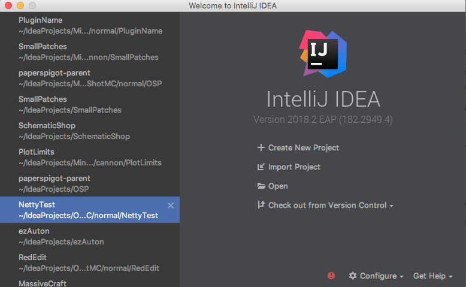
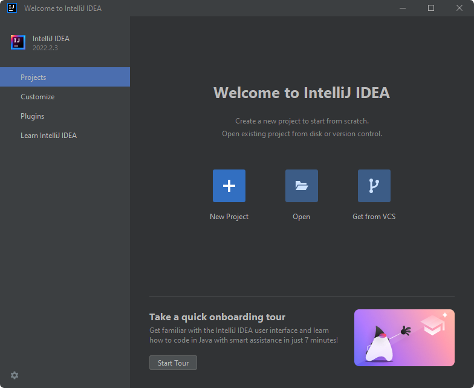
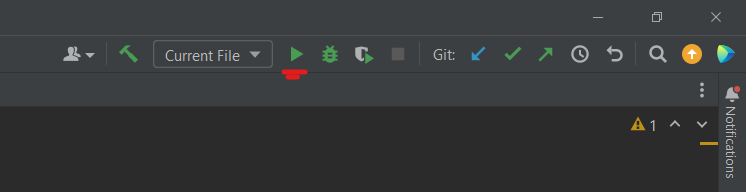
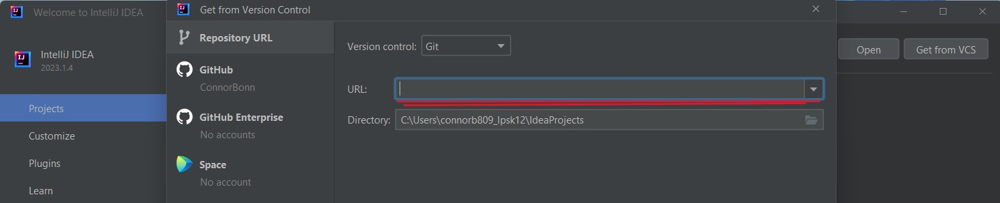
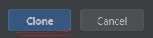
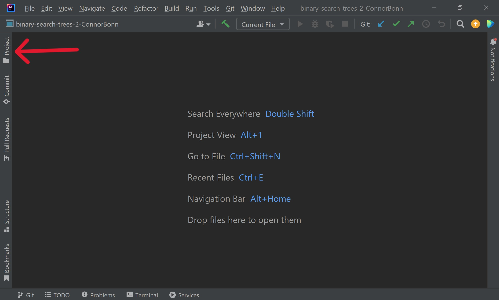

# Polygon Drawer

The Polygon Drawer application is used to draw images using polygons. This is clicking which makes new points which are
used to draw the polygons.

# Getting the project

1. Install Intellij community edition at this [link](https://www.jetbrains.com/idea/download)
2. Scroll down to the community edition of Intellij and install it 
3. Now that you have Intellij installed you can go to [GitHub](https://github.com/login)
4. If you have a GitHub account sign in to your account if not create an account.  **IF YOU HAVE AN ACCOUNT SKIP TO STEP
   7**
5. To create an account go to the bottom of the login page and click on "Create an account"
6. Follow the provided steps
7. Now go to the project at this [link](https://github.com/EPIC-Campus-LPS/polygondrawer-visually-impaired)
8. Click the green "<> Code" button
9. It will give you three options the only 2 that you need to focus on are the Download ZIP and Clone options
10. Download ZIP is underlined in blue and the Clone using web url is underlined in red 
11. If you want to download the entire project hit the download ZIP file and if you don't want to download the project
    copy the link by clicking the two small boxes next to the link
12. Open Intellij

# Download ZIP file

1. If you are opening Intellij for the first time you should be seeing one of two
   screens 
2. Click the folder icon that says open on both screens it's in the center of the page. If it is not there it might be
   in the top right of the screen
3. After clicking the file button you will be able to see all of your files if you can find your downloads folder
4. After locating the folder using the arrows find the project download which should be named "
   polygondrawer-visually-impaired"
5. Click the arrow on the file and click the folder marked "polygondrawer-visually-impaired-master"
6. Select "OK" and the project should open
7. Now all you have to do is locate the project file on the left side of your screen on Intellij and keep clicking the
   arrows until you find the file named "main"
8. Open main and if you have JDK installed you should be able to run it by clicking the green arrow in the top right
   corner, and then you can skip down to the section labeled "Using the Polygon Drawer"

9. If you DO NOT have JDK downloaded then there should be a message that will pop up when you try and run the program
   telling you to download JDK, and it will provide a link to download JDK

# Clone using link

1. To clone using the link you click the two boxes (scroll up to see screenshot) and then open Intellij
2. After opening Intellij you can now click the "Get from VCs" button shown on both of these
   screens 
3. Paste the Link you copied into the bar labeled "URL"
4. Now click the blue "Clone" button in the bottom right of the Intellij window 
5. The project should be open and now just go to the projects button on the left side of your
   screen 
6. Click all the down arrows until you find the "main" folder it should be under "src"
7. Make sure JDK is installed if it isn't there should be a link in the bottom right corner to install it
8. After making sure JDK is installed/installing JDK click the green arrow in the top right of the
   screen

# Using the Polygon Drawer

1. Now that you have the application open all you have to do is click on the application
2. Every click makes a point and once you have 3+ points it will connect the points together
3. If you want to undo something press "ctrl + z" or click the edit button in the top right
4. If you want to reset the drawing press "ctrl + n" or click the polygon button
5. When you make a new point it will connect the closest point and the most recent point
6. If you right-click you can start making a new polygon and the line color will change from yellow to white
7. To close the application click the "X" in the top right corner of the application and hit "YES"