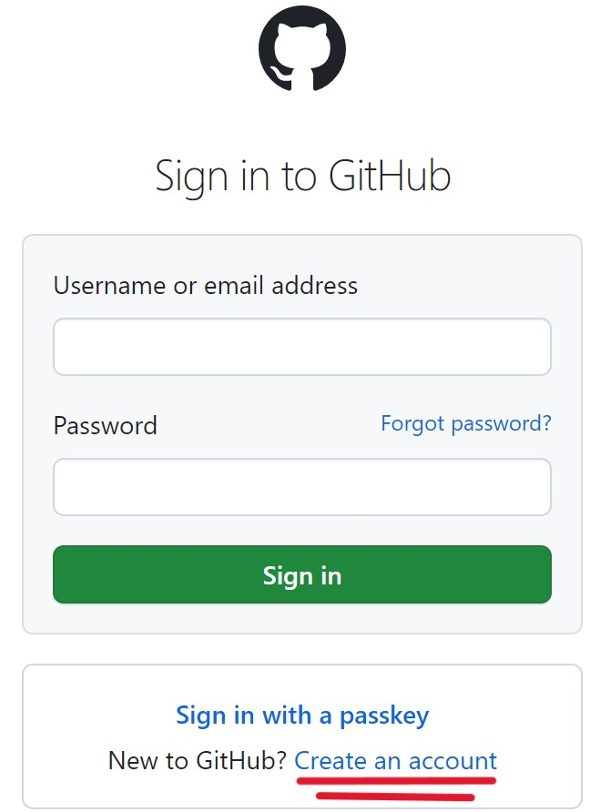
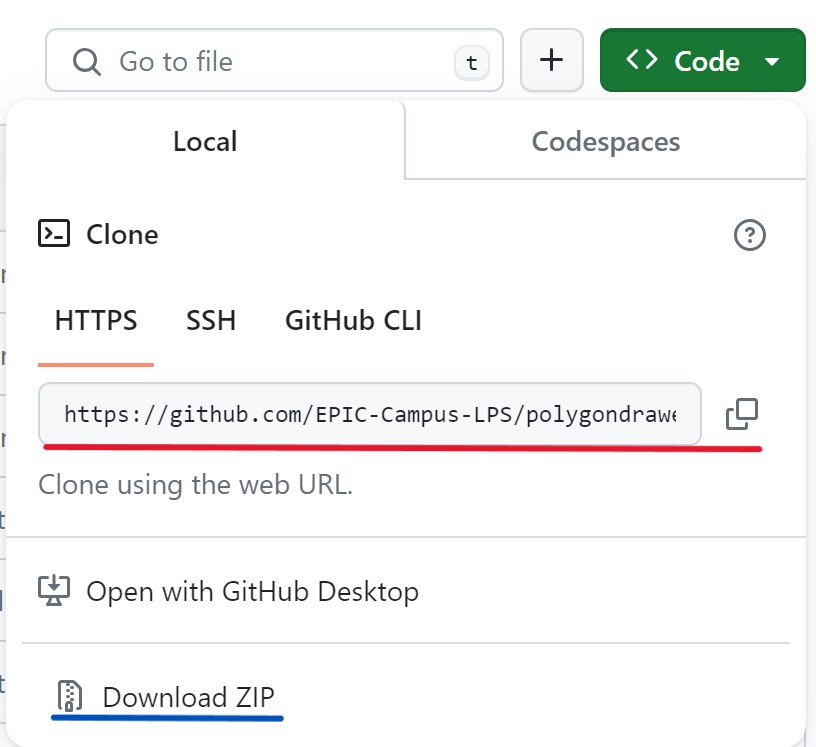

# Polygon Drawer
The Polygon Drawer application is used to draw images using polygons.  This is clicking which makes new points which are used to draw the polygons.

# Getting the project
1. Install Intellij community edition at this [link](https://www.jetbrains.com/idea/download)
2. Scroll down to the community edition of Intellij and install it 
3. Now that you have Intellij installed you can go to [GitHub](https://github.com/login)
4. If you have a GitHub account sign in to your account if not create an account.  **IF YOU HAVE AN ACCOUNT SKIP TO STEP 7**
5. To create an account go to the bottom of the login page and click on "Create an account"
6. Follow the provided steps
7. Now go to the project at this [link](https://github.com/EPIC-Campus-LPS/polygondrawer-visually-impaired)
8. Click the green "<> Code" button
9. It will give you three options the only 2 that you need to focus on are the Download ZIP and Clone options
10. Download ZIP is underlined in blue and the Clone using web url is underlined in red 
11. If you want to download the entire project hit the download ZIP file and if you don't want to download the project copy the link by clicking the two small boxes next to the link
12. Open Intellij

# Download ZIP file
1. 
# Clone using link